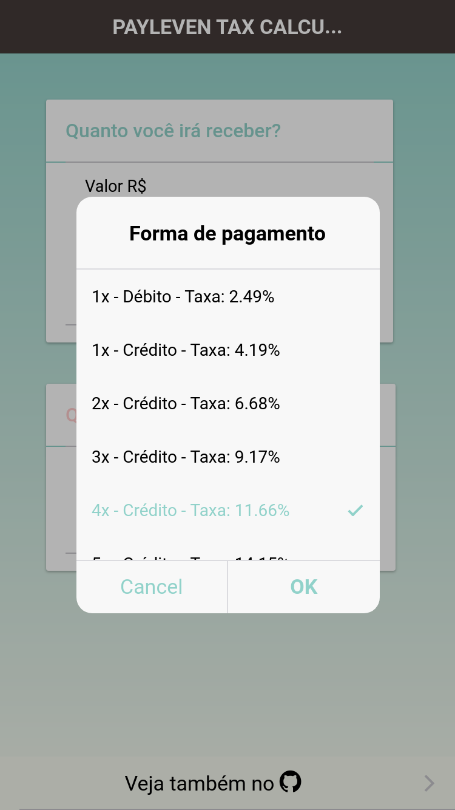

# payleven-tax-calculator :computer:
> done with ionic ~anger~ and love

Ionic hybrid app that calculates how much you need to charge your client to cover the tax :)

  
  

## Setup
Clone as usual and run `yarn && yarn run ionic:serve`

Thanks for all the :fish:
